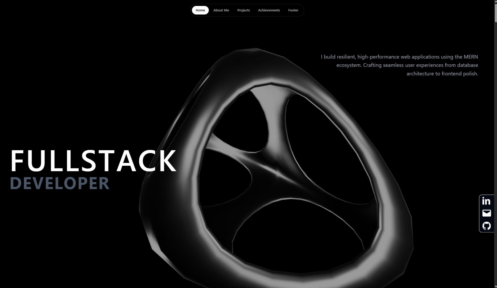

# ✦ Personal Portfolio

A modern, interactive developer portfolio built from scratch with **React, GSAP, Three.js, and Tailwind CSS**.

Designed to showcase my work through smooth animations, scroll-driven interactions, 3D visuals, and a responsive user experience.

[](https://github.com/arunz6/animation)

---

## ✨ Highlights

- Interactive **3D hero experience** with Three.js
- Scroll-driven animations with **GSAP & ScrollTrigger**
- Character and word-level text animations using **SplitText**
- Drag and wheel-based project interactions
- Smooth responsive experience across desktop, tablet, and mobile
- Custom animated mobile navigation
- Component-based architecture with React

---

## 🖥️ Preview

<p align="center">
  
</p>

<p align="center">
  
</p>

<p align="center">
  
</p>

---

## 🛠️ Tech Stack

- **React.js**
- **Vite**
- **Tailwind CSS**
- **GSAP**
  - ScrollTrigger
  - SplitText
  - Draggable
  - Observer
  - InertiaPlugin
- **Three.js**
- **React Three Fiber**
- **React Icons**

---

## 📂 Sections

| Section | Purpose |
|---|---|
| **Home** | Animated introduction with interactive 3D elements |
| **About** | Personal background, skills and technologies |
| **Projects** | Interactive showcase of selected projects |
| **Achievements** | Highlights and milestones |
| **Contact** | Social links and contact information |

---

## 🚀 Getting Started

### 1. Clone

```bash
git clone https://github.com/arunz6/animation.git
cd animation
